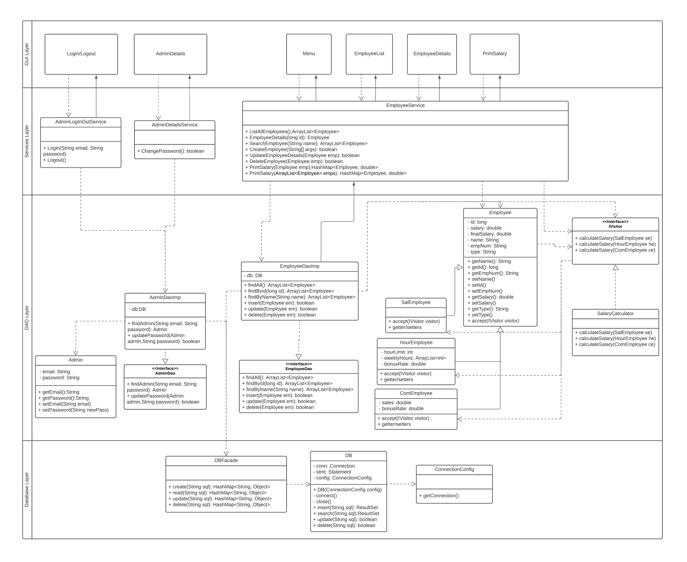

#### Task1
#### 1. Class Diagram Of The System 

#### 2. Behavioural patterns and Architectural patterns
##### Architectural Patterns
- Layer Pattern: 
I have chosen the layer pattern and designed four layers for my system.
  - GUI Layer -> Services Layer-> DAO layers-> Database Layer
##### Behavioural Patterns
   1. Memento Pattern in Database Layer(The Transaction part from JDBC)
   2. Visitor Pattern in DAO Layer
   3. Observer Pattern between GUI Layer and Services Layer
##### Structural Patterns
- Facade Pattern: Be used in Database Layer

##### Why selected Layer Pattern?
According to the context of Task 1, the company want an application that can let the admin login and log out to the system and can do the CRUD operations of employee details, one important feature is calculating the salary of the employee and printing it.

First of all, the user of the application is the admin, so the application should not be a big system for this version and only have fewer users, so Publish-Subscribe pattern and Peer-to-Peer Pattern which are the models of serving large-scale user scenarios is somewhat oversized for our application and involves data changes and calculations that require enhanced system availability, security and data consistency according to project requirements. What is more, data backup might be another important requirement. So that Peer-to-Peer patterns is not fit for our system. Since the communication only from Admin to the server, there is no massive message processing problem. Due to this, the Publish-Subscribe pattern is not fit our system as well. 

Secondly, the application is only used for internal management of employee data and there is no need to deploy it on multiple servers, so if the broker pattern is used instead, it will increase the overhead of the company's servers and there is no need for it. Besides, it seems that the company does not have a huge amount of data (at petabyte-scale) in the system, so the Map-Reduce pattern is not suitable for our application. Similarly, the Shared-data Pattern is not suitable either. For our system, there are no many repeatedly transform streams of discrete data items,  so Pipe and Filter pattern is wasted for our application, it's more useful for some real-time "Big Data"  scenarios.

The application scenarios of SOA pattern and micro Services pattern do not exactly meet our current business needs, although the idea of these two patterns is feasible, encapsulating the query method and exposing the access interface can well increase the flexibility and extensibility of the system. However, the current service is very little only login registration and delete information, calculate salary, etc., can only be split into fewer service modules. If there are more services in the future, the architecture can be improved, however, the corresponding construction and maintenance costs will be increased, so for the current requirements, I prefer other models.

I chose the Layer pattern from the Multi-Tier pattern, the Client-Server pattern and the Layer pattern because the Multi-Tier is more about physically layered and for our application, the upfront requirement for physical components is not high. The multi-Tier pattern will increase our cost The Client-Server pattern was not needed, as our application does not have multiple clients and does not need to share resources and services.

The Layer pattern provides good isolation between layers and greatly improves the cohesiveness between the layers of the system. By layering, the workflow of each requirement becomes clear and each function, between each layer, can be developed and extended independently(e.g. CRUD of the employee can be isolated with calculating employee's salary, you can choose different workflow at services layer without read/write data through CRUD in the database). This ensures good availability, ease of maintenance and scalability. Security is also guaranteed as the layers are accessed via specific one-way interfaces. Although the Layer pattern may increase the cost of design and the complexity of the system, the project life can be extended based on a good design pattern. And it is easy to extend for the future. The downside is that layering can lead to performance degradation(e.g. a request through multiple layers), but this can be mitigated by proper layering. Finally, there is the advantage that iteration is faster and the overall cost is lower than other patterns.

##### Why selected Memento Pattern, Observer Pattern and Visitor Pattern
1. Memento Pattern(JDBC): 
   1. Provides a mechanism for the user to restore state, making it easier for the user to return to a historical state
      - In my design, database operations are involved, however, data storage or modification is likely to fail for some reason, which is not something users would like to see. So for data consistency, I chose to use the transaction provided by JDBC to ensure that when the operation on the data fails the transaction will roll back to the state before the failure, which is the “restore state” of the Momento Pattern.
   2. Enables encapsulation of information so that the user does not need to be concerned with the details of state retention
      - The transaction is encapsulated in JDBC api.
2. Observer Pattern(JavaFX):
   1. The GUI layer, where the user interacts with the component, uses the Observer pattern, for example, in JavaFX, when the user clicks a button, it triggers its Observer (ClickEvenListener) and sends the request from the GUI layer to the Services layer
3. Visitor Pattern(SalaryCalculator): 
   1. One reason is, according to the requirement of calculating the salary for a different type of employees. I realized the calculating way depends on the concrete class of employee and there are three types of employee. Each type of employee uses a different rule(not very different) for calculating. 
      The structure of each type of employee is rarely changed(especially the attributes are related to calculating salary ). Maybe in the future, there will be some requirements for adding new operations to these class.
   2. Another reason is the good extensibility and flexibility that comes with the visitor pattern. It reduces the cost of adding new operations (except adding new classes) and does not pollute the class structure. The separation of the data structure and the manipulation of the data is achieved.
   
#### 3 Code
##### See gui folder, services folder, dao folder, database folder and testForSalaryCalculator class