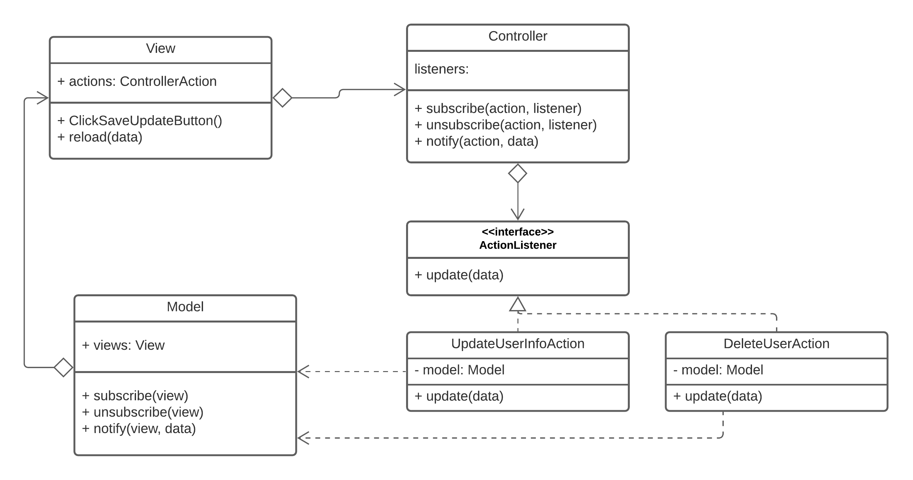
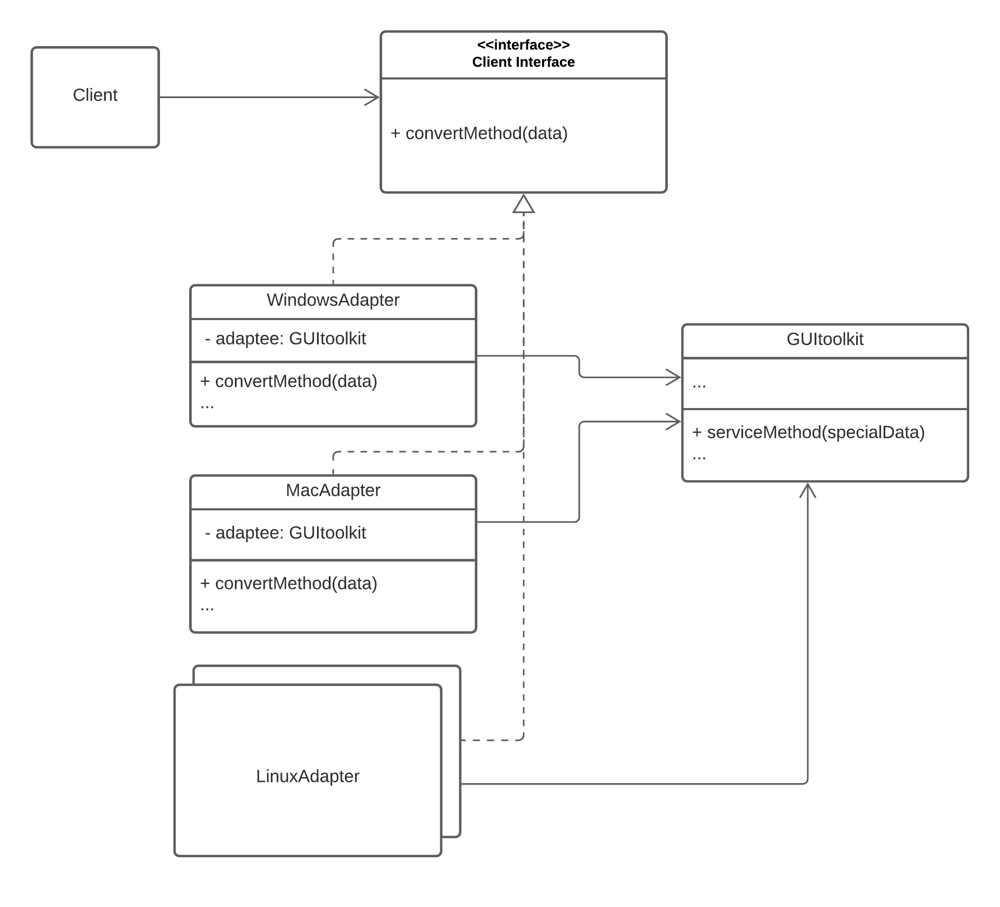
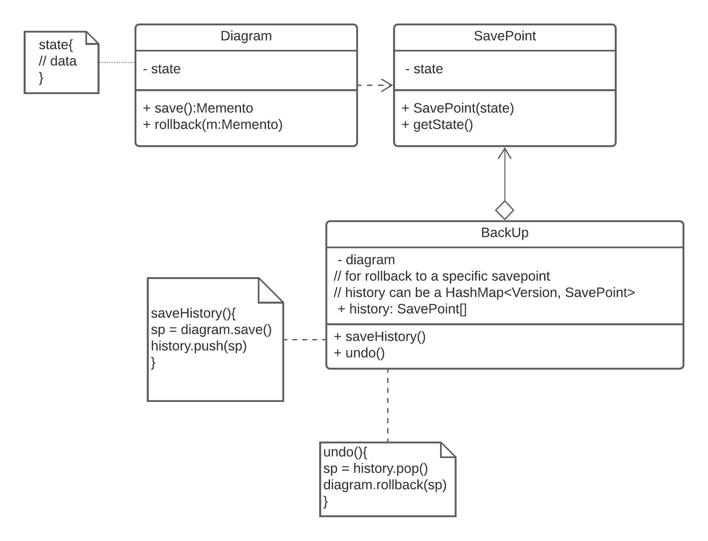

## 4
#### Observer Pattern
According to the context, there is a single model that works with many views and controllers which means there is a single data object with many presentations. What is more, this is an MVC framework, which means the single model(data object) is independent of views or controllers(presentation layer). Besides, when an action happens, it requires many views and controller working together to be synchronised, you can know that each presentation doesn't know each other, so that they need to work together and also when the model changed, the presentations will be notified and update.

For example, if a user updates their personal information in the view and then clicks the Save Update button, the observer (UpdateButtonClickListener) of this button in the User Controller receives a notification that the user's user information has changed, and after the UserController has processed the data, the User model After the UserController has processed the data, the User model receives a notification and updates this user information. As a result of the change in user information, the user's personal information page, the user list page and all pages involving this user information are updated to the latest data.

So observer pattern can best solve this case

  

## 5
#### Adapter Pattern
According to the context, the GUI toolkit provides GUI functions and components, however, the functions for the Windows platform is not suitable for the Mac platform or other platforms. The logic of functions is common from different platforms and we want to reuse the logic. What is more, we just want to have minimal changes to the client code for the new platform which means we only need to add an adapter for the new platform and convert the data to the special data that GUItoolkit accepts without changing the GUI toolkit. So, the adapter pattern is the best solution for this scenario. Due to Java does not support multiple extend(extend two class), so I use the object adapter, it will make the application more flexible.

  

## 6
#### Memento Pattern

According to the context, the application can do a multi-level undo according to a history of operations. From this, command and memento pattern all can do this 'undo' operation. However, I think a memento pattern is more suitable for the scenario. Command pattern more focuses on encapsulating the request of operations as an object, so it’s convenient to store command object for executing an undo operation. Other than encapsulating a request, the memento pattern more focuses on storing the state of the object of the operation. Back to the scenario, due to this is a diagramming application which means we need to store all the data(snapshot of the current state)of the diagram each time which allow us to do a multi-level undo, more than that you can choose the specific savepoint to rollback. So I think the memento pattern is the best solution to this.

  

