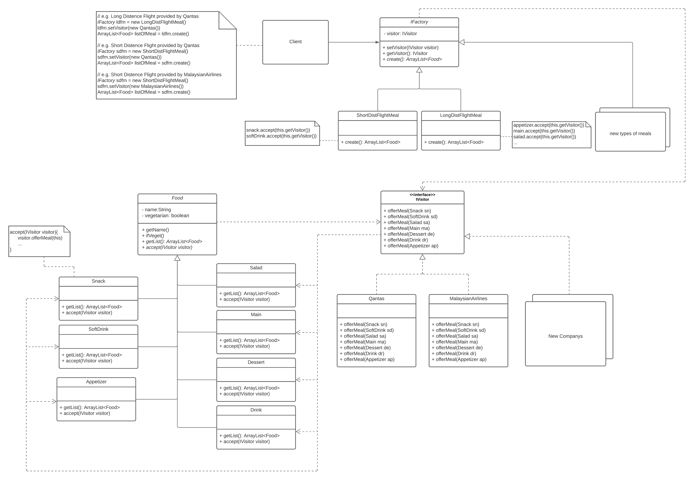

# 7

I have used three design patterns(From the top of the class diagram to the bottom):
- Abstract factory pattern
- Bridge pattern
- Visitor pattern

Essential examples have written in note entity
 

  

# 8

For(1), the abstract factory pattern encapsulates the progress of making meals, it only provides an interface to the client. Since the client only deals with the IFactory and calls methods in the interface, it doesn't need to know in which specific factory the methods are implemented, making it easy to replace the factory. So, for this scenario, we just need to add a new factory(medium distance flight meal) and change one line in the client code. What is more, in the future, if one of the concrete factories changed internal logic, e.g. short distance flight meal start offering dessert, we could only change the factory code without changing the client code.

For(2), the changes to catering brought about by the addition of a new airline are solved by the visitor pattern, which isolates the data structure from the data processing, so that for the new airline we only need to add the catering logic of the company separately, without changing the data structure of the food and other class. For the client, a change to the new airline (visitor) requires only one line of code. Also, in the same way as abstract factory pattern, if instead of adding a new airline, the client does not even need to change its code if it changes the serving rules of an existing airline, isolating the client from the change.

Because each abstract factory concrete class has two classifications (flight length, airline) and the two variations are independent and mutable. If inheritance is used, this results in the need to construct a large number of factory classes, which increases coupling and makes the system less scalable. By separating the two variations through the bridge pattern, the two variations can be changed independently without adding classes, and can simply be combined as required. This increases flexibility and scalability, and because the process of combining them is not visible to the client using the abstract factory pattern, the changes are isolated from the client. A good combination of the abstract factory pattern and the visitor pattern

  